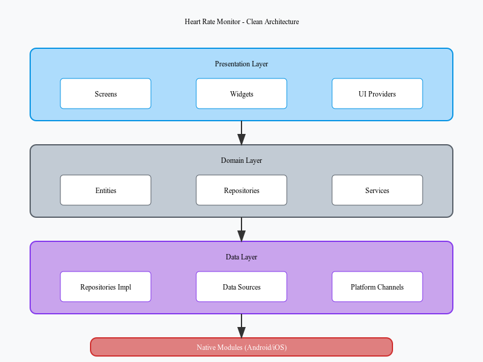

# Heart Rate Monitor

<p align="center">
  
</p>

<p align="center">
  A modern, cross-platform heart rate monitoring application built with Flutter, featuring simulated device connectivity and advanced heart rate analysis.
</p>

<p align="center">
  <a href="#features">Features</a> •
  <a href="#screenshots">Screenshots</a> •
  <a href="#architecture">Architecture</a> •
  <a href="#installation">Installation</a> •
  <a href="#usage">Usage</a> •
  <a href="#device-simulation">Device Simulation</a>
</p>

## Screenshots

<p align="center">
  
  
  
  
</p>

## Features

✅ **Real-time Heart Rate Monitoring** - Visualize your heart rate in real-time with animated UI

✅ **Heart Rate Analysis** - Automatic categorization into Low, Normal, Elevated, High, or Critical ranges

✅ **Device Connectivity** - Simulated heart rate monitoring device with realistic behavior

✅ **Battery & Signal Tracking** - Monitor device battery and signal strength

✅ **Cross-Platform** - Works seamlessly on both iOS and Android

✅ **Clean Architecture** - Follows best practices with Domain-Driven Design principles

✅ **Medical UX** - Professional, calming UI designed for medical applications

## Architecture

This application follows Clean Architecture principles, with a clear separation of concerns:

<p align="center">
  
</p>

### Layers

- **Domain Layer**: Contains business logic, entities, and repository interfaces
- **Data Layer**: Implements repositories and data sources
- **Presentation Layer**: UI components using Flutter widgets
- **Native Modules**: Platform-specific code for iOS and Android

### Key Components

- **Heart Rate Entity**: Core domain model representing heart rate data
- **Device Info Entity**: Domain model for connected devices
- **Platform Channels**: Bridge between Flutter and native code
- **Riverpod**: State management throughout the application

## Technology Stack

- **Flutter** - Cross-platform UI toolkit
- **Riverpod** - State management
- **Kotlin** - Android native code
- **Swift** - iOS native code
- **Platform Channels** - Native communication
- **Dartz** - Functional programming utilities

## Installation

1. **Clone the repository**

```bash
git clone https://github.com/rezakkm/heart_rate_assessment.git
cd heart_rate_monitor
```

2. **Install dependencies**

```bash
flutter pub get
```

3. **Run the application**

```bash
flutter run
```

## Usage

1. **Start Monitoring**
   
   Press the "Start" button to begin monitoring your heart rate. The application will connect to a simulated heart rate monitoring device.

2. **Interpret Results**
   
   - Heart rate is displayed prominently with color coding
   - Status indicator shows if your heart rate is NORMAL, LOW, ELEVATED, HIGH, or CRITICAL
   - Detailed analysis explains what your heart rate means
   - Device connection status shows battery level and signal strength

3. **Stop Monitoring**
   
   Press the "Stop" button to stop heart rate monitoring.

## Device Simulation

This application simulates heart rate monitoring devices with realistic properties:

- **Device Types**: Various device models (BeatMaster Pro, HeartSense Ultra, etc.)
- **Dynamic Properties**: Battery levels decrease over time, signal strength fluctuates
- **Connection Status**: Occasionally simulates connection issues
- **Accuracy Levels**: Different devices have varying accuracy levels
- **Heart Rate Patterns**: Generates realistic heart rate values with occasional abnormal readings

### How It Works

1. **Native Modules**: The simulation occurs in native code (Kotlin for Android, Swift for iOS)
2. **Platform Channels**: Heart rate data is streamed to Flutter via EventChannels
3. **Flutter UI**: Processes and displays the heart rate data with visual feedback

## Project Structure

```
heart_rate_monitor/
├── android/                    # Android native code
│   └── app/src/main/kotlin/   
│       ├── models/            # Device models
│       ├── utils/             # Heart rate generation utilities
│       └── HeartRateModule.kt # Core heart rate generation
├── ios/                        # iOS native code
│   └── Runner/
│       ├── Models/            # Device models
│       ├── Utils/             # Heart rate generation utilities 
│       └── HeartRateModule.swift # Core heart rate generation
├── lib/
│   ├── core/                   # Core utilities and constants
│   ├── data/                   # Data layer
│   │   ├── datasources/        # Heart rate data sources
│   │   ├── models/             # Data models
│   │   ├── providers/          # Riverpod providers
│   │   └── repositories/       # Repository implementations
│   ├── domain/                 # Domain layer
│   │   ├── entities/           # Domain entities
│   │   ├── repositories/       # Repository interfaces
│   │   └── services/           # Domain services
│   └── presentation/           # UI layer
│       ├── screens/            # App screens
│       ├── widgets/            # Reusable widgets
│       └── providers/          # UI-related providers
└── assets/                     # Images and other assets
```

## Contributing

Contributions are welcome! Please feel free to submit a Pull Request.

1. Fork the repository
2. Create your feature branch (`git checkout -b feature/amazing-feature`)
3. Commit your changes (`git commit -m 'Add some amazing feature'`)
4. Push to the branch (`git push origin feature/amazing-feature`)
5. Open a Pull Request

## License

This project is licensed under the MIT License - see the LICENSE file for details.

## Acknowledgements

- The heart rate analysis ranges are based on generally accepted medical guidelines
- The device simulation models are fictional and for demonstration purposes only
- UI design inspired by modern medical applications
- Icons provided by [Material Design](https://material.io/resources/icons/)

---

<p align="center">
  Made with ❤️ for monitoring your heart rate
</p>

---

## Note about Assets

This repository includes SVG files for the logo and architecture diagram in the `assets` folder. For best display on GitHub:

1. Convert the SVG files to PNG using an online converter like [SVG to PNG](https://svgtopng.com/)
2. Save the converted files with the same names in the assets folder

## Note about Screenshots

Please refer to the `screenshots/README.md` file for detailed guidelines on taking screenshots for this README.
